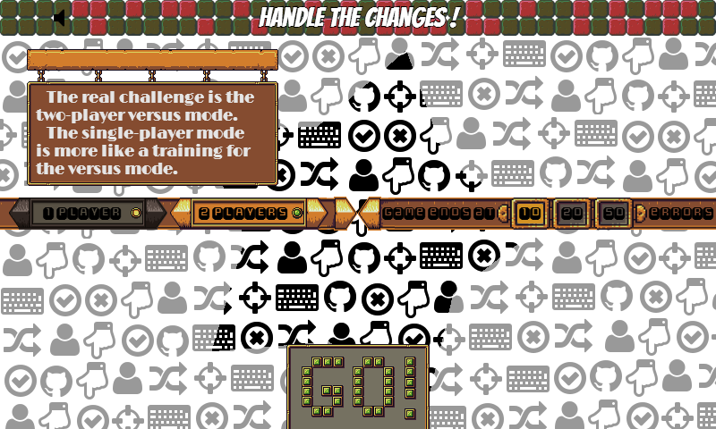
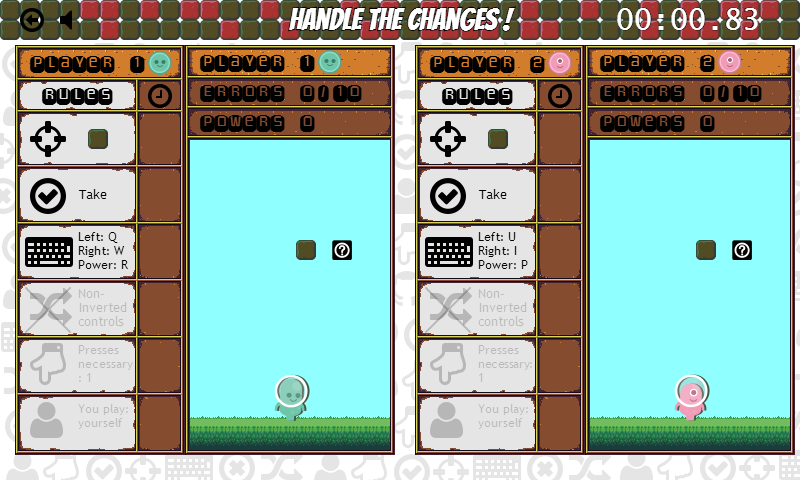

# Handle The Changes !

## Description

Handle The Changes is a *2-player versus game* (even if a single-player pratice mode is available). The goal is to make less mistakes than you opponent to win.

Difficulty and originality are based on the fact that the *rules are changing* during the game.

**Fit the changes and you'll win !**

## Attributions

I used the awesome [CreateJS](http://www.createjs.com/#!/CreateJS) libraries.

And I would like to thank the creators of the *free and open source* assets below :
- the playable characters : [kenney.nl](http://kenney.nl/)
- the HUD, grass and stones : [Buch](http://opengameart.org/users/buch)
- some icons : [ionicons](http://ionicons.com/)
- the other icons : Font Awesome by Dave Gandy - [http://fontawesome.io](http://fontawesome.io/)
- musics : [kasa90](http://www.freesound.org/people/kasa90/)
- sounds : made with [sfxr](http://www.drpetter.se/project_sfxr.html) by DrPetter
- Google Fonts : Limelight (by Sorkin Type), Monofett and Bangers (by Vernon Adams)

## Screenshots

*Beginning of a versus game :*

## About the game

Handle The Changes is a *HTML5 game* created by me (Aurélien Picolet) for the [GitHub Game Off II](https://github.com/blog/1674-github-game-off-ii) of November 2013.
